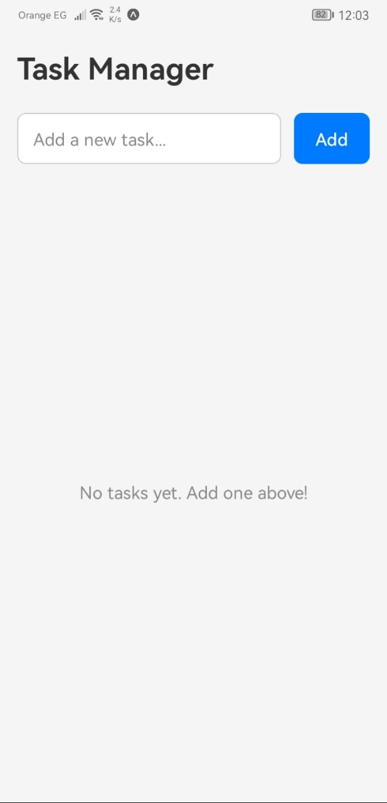

# Task Manager

A simple mobile task management app built with React Native and Expo. It lets you create, complete, and delete tasks with a clean, minimal interface.

## Setup and Running

1. Install dependencies:
   ```bash
   npm install
   ```
2. Start the development server:
   ```bash
   npx expo start
   ```
3. Scan the QR code with Expo Go (Android) or the Camera app (iOS) to open the app on your device. You can also press `a` for Android emulator, `i` for iOS simulator, or `w` for web.

## Screenshots

| Empty State                                     | Adding Tasks                                      | Completed Tasks                                         |
| ----------------------------------------------- | ------------------------------------------------- | ------------------------------------------------------- |
|  |  |  |

## Features

- **Add Tasks** — Type a task title and tap "Add" (or press the keyboard submit button) to create a new task.
- **Mark Complete** — Tap on any task to toggle its completed status. Completed tasks show a checkmark and strikethrough text.
- **Delete Tasks** — Tap the "X" button on a task to remove it.
- **Progress Tracking** — The header displays a completion counter (e.g. "3/5 done").
- **Empty State** — A friendly message is shown when there are no tasks.

## Project Structure

```
TaskManager/
├── App.tsx              # Root component with header and layout
├── index.ts             # Entry point (registers the app with Expo)
├── components/
│   ├── TaskInput.tsx     # Text input and "Add" button
│   ├── TaskItem.tsx      # Single task row (checkbox, title, delete)
│   └── TaskList.tsx      # FlatList of tasks with empty state
├── hooks/
│   └── useTasks.ts       # Custom hook managing task state (add, toggle, delete)
└── types/
    └── Task.ts           # TypeScript interface for a Task
```

## Third-Party Libraries

| Library                                     | Purpose                                                                                                                                   |
| ------------------------------------------- | ----------------------------------------------------------------------------------------------------------------------------------------- |
| **expo** (~54.0.33)                         | Framework and toolchain for building and running React Native apps. Provides the development server, build tools, and the Expo Go client. |
| **react** (19.1.0)                          | Core UI library for building component-based interfaces with a declarative approach.                                                      |
| **react-native** (0.81.5)                   | Framework for rendering native mobile UI components on iOS and Android using React.                                                       |
| **react-native-safe-area-context** (~5.6.0) | Handles safe area insets (notches, status bars) so content doesn't overlap with system UI elements.                                       |
| **expo-status-bar** (~3.0.9)                | Provides a component to control the appearance of the device status bar (light/dark).                                                     |
| **typescript** (~5.9.2)                     | Adds static type checking to JavaScript, catching errors at compile time. (dev dependency)                                                |
